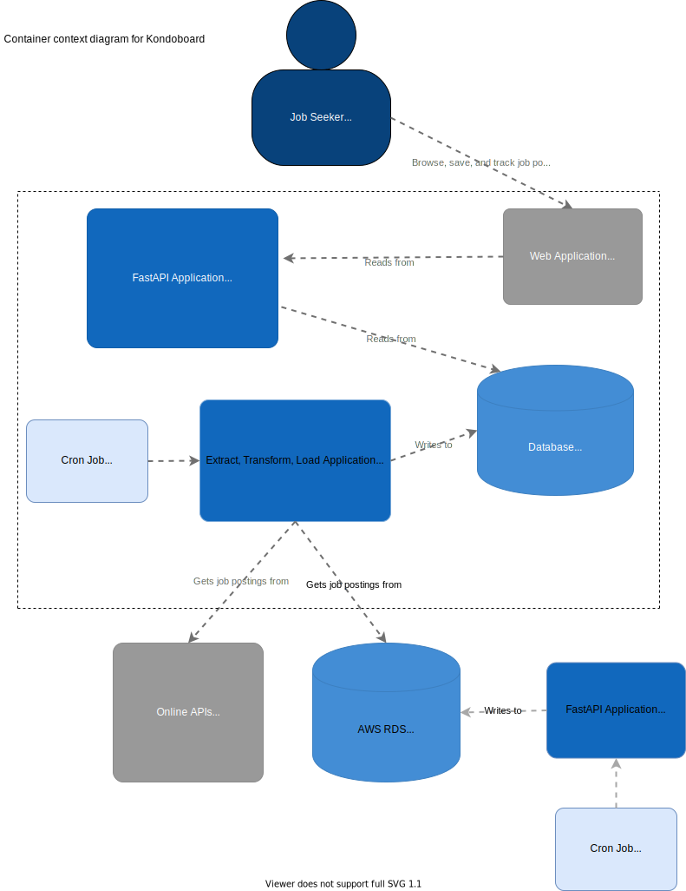

# kondoboard-cron

This repo contains the extract, transform, load application for Kondoboard, a platform that allows Lambda School students to browse, save, and track job postings during the job hunt. 

## Table of Contents
- [Background](#background)
- [Diagrams](#diagrams)
- [Install](#install) 
- [Usage](#usage)
- [Testing](#testing)
- [API](#api)
- [License](#license)

## Background
```
```

## Diagrams
We created C4 diagrams to communicate the software architecture

### Context

### Container


## Install  
```
```
## Usage  
```
```  
## Testing  
```
```  
## API

[FastAPI - Swagger documentation](http://kondoboard-ds-environment.eba-u7c3zdzn.us-east-1.elasticbeanstalk.com/docs)  
 
## License
